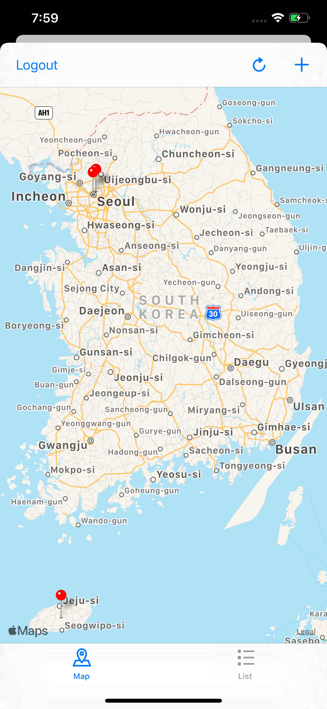
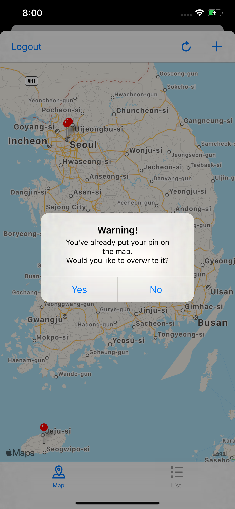
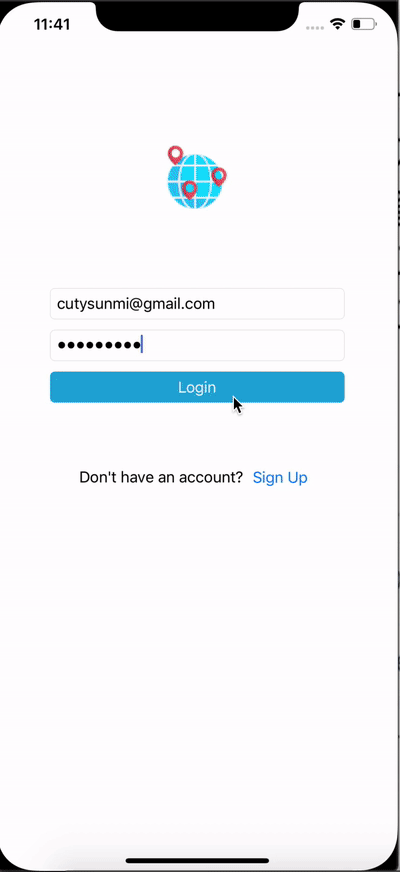
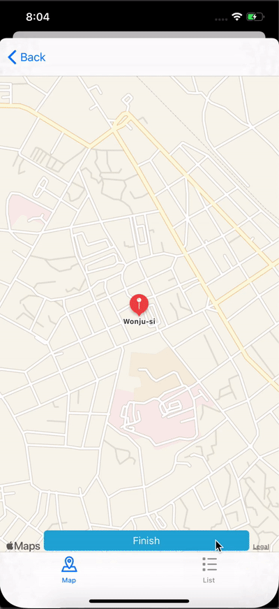

# OnTheMap

This apps shows spot on the map. Pin pointed out Udacity student location. 
When user tapping on the pins, it shows URL and information. 
The user is possible to add their own data by posting a string that can be geocoded to a location, and a URL.

- 웹 서비스에서 데이터를 끌어와 핀으로 지도를 표시됩니다. 핀을 누르면 다른 학생이 해당 위치에 개시한 사용자 지정 URL이 표시됩니다.
- 사용자는 udacity 계정으로 로그인 한 뒤, 위치를 지도에 추가할 수 있습니다. 
- 사용자는 위치에 설정된 위치에 기존의 url을 입력하면, 핀의 위치가 바뀌며 업데이트 됩니다. 

## Features 

1) Student can post a location along with a url.
2) Locations and urls posted by other students. It   appear in a MapView and a TableView.

## Requirements

- Xcode 10.3
- Swift 5

## Screenshots & Video
      

---

  
   
  

 &nbsp;
---

## License
This code is free and open source and I have build this project for my Udacity submission.

            
